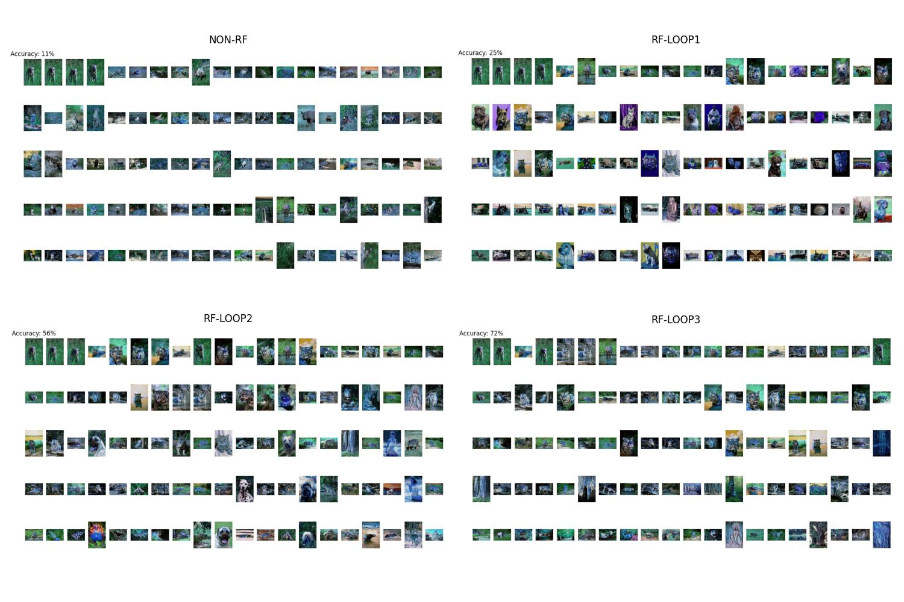

# Relevance Feedback using SVM Active Learning in Python

A Python implementation of SVM-Active-based Relevance Feedback based on paper [Image Retrieval with Relevance Feedback using SVM Active Learning](https://www.researchgate.net/publication/316508249_Image_Retrieval_with_Relevance_Feedback_using_SVM_Active_Learning)

## Demo
As the demo below, the accuracy (mAP) of retrieval results is improved after each iteration of relevance feedback:


## Requirements
**1. Image Dataset**
- I use Corel dataset that is very popular in CBIR to demo. The data folder is compressed at [Corel.zip](https://github.com/HoangPham3003/SVM-Active-Learning-for-Relevance-Feedback/blob/main/db/Corel.zip) in my repository.
- Paths of images are saved as PKL file at [paths.pkl](https://github.com/HoangPham3003/SVM-Active-Learning-for-Relevance-Feedback/blob/main/db/features/paths.pkl).
**2. Features Database**
- All Corel images are extracted to 4096d-vectors features using CNN. I use VGG19 as a feature extractor. The features database is compressed at [features.zip](https://github.com/HoangPham3003/SVM-Active-Learning-for-Relevance-Feedback/blob/main/db/features/features.zip) in my repository.

## Main objectives
- As authors: "In content-based image retrieval, relevant feedback is studied extensively to narrow the gap between low-level image feature and high-level semantic concept. In general, relevance feedback aims to improve the retrieval performance by learning with user’s judgements on the retrieval results."
- Active-SVM method that is proposed in the paper not only provides an effective selection of data samples for training SVM but also creates a new ranking function in order to improve retrieval results after each iteration of feedback.

## Running
Argparse:
- query_image_path: path of image query to search
- rf: use relevance feedback or not
- rf_loop: number of iterations of relevance feedback
- k_future: number of samples being labeled in future by active learning
**1. Image Retrieval Without Relevance Feedback**
``` shell
python rf.py --query_image_path db/Corel/wl_tiger/108009.jpg
```
**2. Image Retrieval With Relevance Feedback**
``` shell
python rf.py --query_image_path db/Corel/wl_tiger/108009.jpg --rf True --rf_loop 3 --k_future 500
```
